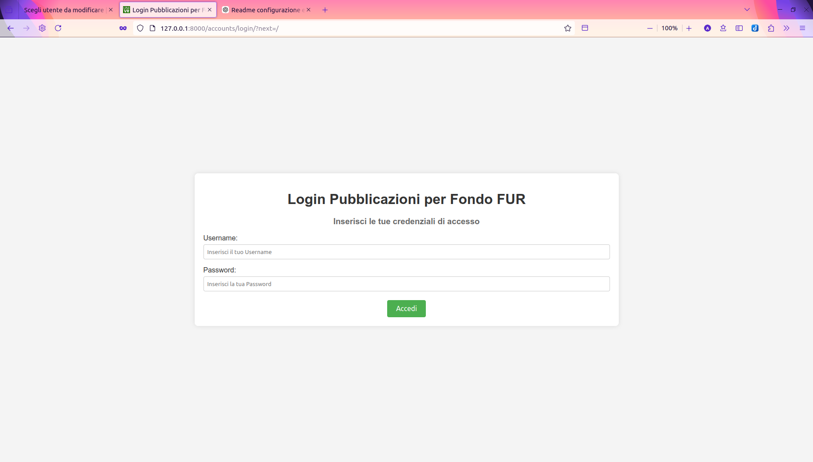
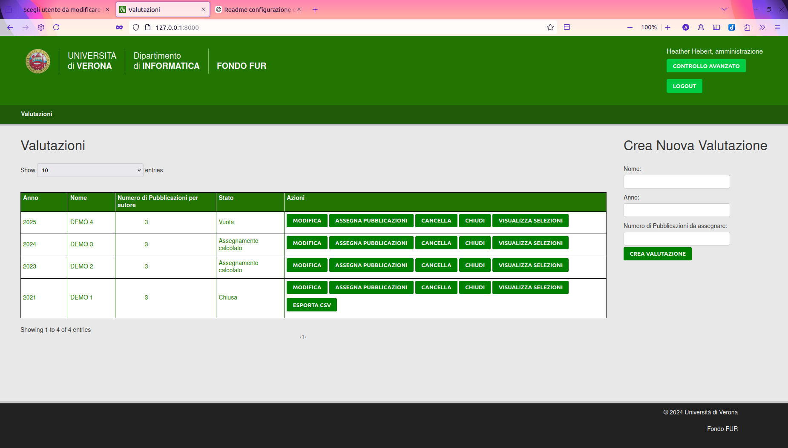
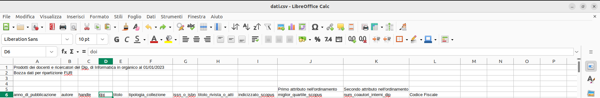

# furapp

Lo scopo di questo programma è semplificare la gestione e l'estrazione delle pubblicazioni dei docenti universitari per il calcolo del fondo FUR. L'obiettivo è creare un portale che permetta l'estrazione automatica delle pubblicazioni e la selezione manuale da parte degli autori, rendendo il processo semplice e intuitivo.

</br>
</br>

## Preparazione Iniziale

### Installazione

1. Clona il repository:
   ```bash
   git clone https://github.com/Hex-Zivi/Tesi.git
   cd Tesi
   ```

2. Assicurati di avere Django installato.

3. Esegui il comando per l'installazione dei pacchetti:
   
   ```bash
   pip install -r requirements.txt
   ```
### Configurazione dell'url

Modifica FUR/settings.py:

```python
DEBUG = False

ALLOWED_HOSTS = ['localhost', '127.0.0.1']
```

### Configurazione del Database

FUR/settings.py, modifica la configurazione del database a seconda delle tue necessità. Attualmente, è impostato su PostgreSQL. Per ulteriori informazioni, consulta la [pagina di Django](https://docs.djangoproject.com/en/5.0/ref/databases/):

```python
DATABASES = {
        'default': {
                'ENGINE': 'django.db.backends.postgresql_psycopg2',
                'NAME': 'nome_base_di_dati',
                'USER': 'utente',
                'PASSWORD': '######',
                'HOST': 'localhost',
                'PORT': '5432',
        }
}
```

### Configurazione del server LDAP

FUR/settings.py modifica la configurazione del server LDAP a seconda delle tue necessità:

```python
import ldap
from django_auth_ldap.config import LDAPSearch


#...
#...
#...

AUTH_LDAP_SERVER_URI = 'ldap://localhost'
LDAP_DOMAIN = "dc=univr,dc=it"

AUTH_LDAP_BIND_DN = f'cn=admin,{LDAP_DOMAIN}'
AUTH_LDAP_BIND_PASSWORD = 'test1234'
AUTH_LDAP_USER_SEARCH = LDAPSearch(
    f'{LDAP_DOMAIN}',
    ldap.SCOPE_SUBTREE,
    '(uid=%(user)s)',
)


AUTH_LDAP_USER_ATTR_MAP = {
    'first_name': 'givenName',
    'last_name': 'sn',
    'codice_fiscale': 'univrCF',
    'ruolo': 'objectclass',
    'uid': 'uidnumber'
}

REST_FRAMEWORK = {
    'DEFAULT_AUTHENTICATION_CLASSES': (
        'rest_framework.authentication.SessionAuthentication',
    ),
}

AUTHENTICATION_BACKENDS = (
    "django_auth_ldap.backend.LDAPBackend",
    "django.contrib.auth.backends.ModelBackend",
)
```

### Migrazione del Database

Esegui nel terminale:

```bash
python3 manage.py makemigrations
python3 manage.py migrate
```

In questo modo si creeranno i modelli necessari al funzionamento. Successivamente, bisogna configurare il modello utente personalizzato (CustomUser) come utente di default di Django.

Aggiungi in FUR/settings.py:

```python
AUTH_USER_MODEL = 'caricamentoDati.CustomUser'
```

Esegui nuovamente:

```bash
python3 manage.py makemigrations
python3 manage.py migrate
```

</br>
</br>

## Primo utilizzo

Prima di poter utilizzare il programma è necessario creare un superutente che possa accedere alla pagina di amministrazione

### Creare un superuser

Crea un superuser:

```python
python3 manage.py createsuperuser
```

E seguire la procedura, sarà necessario fornire un Username, una mail e una password.

Avvia il server:

```bash
python3 manage.py runserver
```

Gli Utenti potranno accedere al server con le proprie credenziali GIA.

Accedi alla pagina di amministrazione:

```url
[url_dell'applicazione]/admin
```

Ed impostare manualmente i permessi.

In alternativa si possono impostare metodi di riconoscimento autmatico, avendo la struttura del server LDAP al login modificando FUR/views.py

</br>
</br>


## Utilizzo

### Lato server

Avvia il server:

```bash
python3 manage.py runserver
```

### Lato applicazione

Gli utenti possono accedere con le proprie credenziali GIA.



Per la sessione, in FUR/settings.py:

```python
SESSION_EXPIRE_SECONDS = 3600

SESSION_EXPIRE_AFTER_LAST_ACTIVITY = True

SESSION_TIMEOUT_REDIRECT = '/'
```

#### Amministrazione

L'amministrazione può gestire le valutazioni, caricare pubblicazioni da CSV, assegnare pubblicazioni, chiudere valutazioni ed esportare i dati.



#### Utente

L'utente può accedere alle proprie pubblicazioni nelle valutazioni e selezionarle.

### L'algoritmo

L'algoritmo di estrazione segue un ordine di precedenza per selezionare le pubblicazioni, partendo dalle riviste eccellenti fino a risolvere i conflitti tra autori.


## NOTA

Il file CSV deve rispettare un formato specifico.



È possibile adattare la vista per il caricamento in caricamentoDati/views.py:

```python
def caricamento_con_file(request, filename, valutazione):
    if request.method == 'POST':
        file = request.FILES.get('filename')
        valutazione = Valutazione.objects.get(nome=valutazione)
        elenco = []
        intestazione = ['anno_di_pubblicazione', 'autore', 'codice_fiscale', 'handle', 'doi', 'titolo',
                        'tipologia_collezione',
                        'issn_o_isbn', 'titolo_rivista_o_atti', 'indicizzato_scopus', 'miglior_quartile_scopus',
                        'num_coautori_interni_dip', 'codice_fiscale']
        riferimento = []
        if file:
            # Determina il tipo di file
            if file.name.endswith('.csv'):
                csv_data = csv.reader(file.read().decode(
                    'utf-8').splitlines(), delimiter=',')
                for valore in csv_data:
                    elenco.append(valore)
            elif filename.endswith('.xlsx'):
                workbook = openpyxl.load_workbook(file)
                sheet = workbook.active
                for row in sheet.iter_rows(values_only=True):
                    elenco.append(row)
            else:
                # Gestisci il caso in cui il tipo di file non è supportato
                return HttpResponse("Il tipo di file non è supportato.")

            for element in elenco[5]:
                for titolo in intestazione:
                    if element.lower() == titolo:
                        riferimento.append(intestazione.index(titolo))

            with transaction.atomic():

                # In assenza di un file di caricamento veritiero, ho aggiunto una colonna per il codice fiscale alla fine: modificare i numeri delle colonne in maniera consona
                for riga in elenco[6:]:
                    anno_pubblicazione = riga[0]
                    autore = riga[1]
                    handle = riga[2]
                    doi = riga[3]
                    titolo = riga[4]
                    tipologia_collezione = riga[5]
                    issn_isbn = riga[6]
                    titolo_rivista_atti = riga[7]
                    titolo_rivista_atti = titolo_rivista_atti.upper()
                    indicizzato_scopus = riga[8].lower()
                    if indicizzato_scopus in ['vero', '1', 'true']:
                        indicizzato_scopus = True
                    else:
                        indicizzato_scopus = False
                    if riga[9] == '':
                        miglior_quartile = 0
                    else:
                        miglior_quartile = int(riga[9])
                    num_coautori_dip = riga[10]
                    codice_fiscale = riga[11]
                    autore = autore.upper()
                    codice_fiscale = codice_fiscale.upper()

                    if not Docente.objects.filter(codiceFiscale=codice_fiscale).exists():
                        Docente(codiceFiscale=codice_fiscale,
                                cognome_nome=autore).save()

                    if not PubblicazionePresentata.objects.filter(handle=handle).exists():
                        PubblicazionePresentata(handle=handle,
                                                issn_isbn=issn_isbn,
                                                anno_pubblicazione=anno_pubblicazione,
                                                doi=doi,
                                                titolo=titolo,
                                                tipologia_collezione=tipologia_collezione,
                                                titolo_rivista_atti=titolo_rivista_atti,
                                                indicizzato_scopus=indicizzato_scopus,
                                                miglior_quartile=miglior_quartile,
                                                num_coautori_dip=num_coautori_dip,
                                                valutazione=valutazione).save()

                    if not RelazioneDocentePubblicazione.objects.filter(pubblicazione=handle,
                                                                        autore__codiceFiscale=codice_fiscale).exists():
                        RelazioneDocentePubblicazione(pubblicazione=PubblicazionePresentata.objects.get(handle=handle),
                                                      autore=Docente.objects.get(codiceFiscale=codice_fiscale)).save()

        if valutazione.status == "Vuota":
            valutazione.status = "Pubblicazioni caricate"
            valutazione.dataCaricamentoPubblicazioni = datetime.date.today()
            valutazione.save()

    return redirect('modifica_valutazione', valutazione)
```


## Schema sql

Per ottenere uno schema SQL del database è possibile esportarlo col comado da terminale:

```bash
pg_dump -U myuser -s -f schema.sql mydatabase
```

## Ringraziamenti

Ringrazio per il contributo:

- Dr. Belussi Alberto
- Dott.ssa Migliorini Sara
- Dott.ssa Dalla Vecchia Anna
- Zanetti Alex